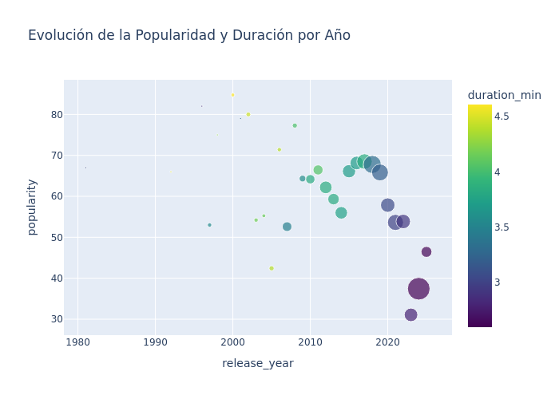
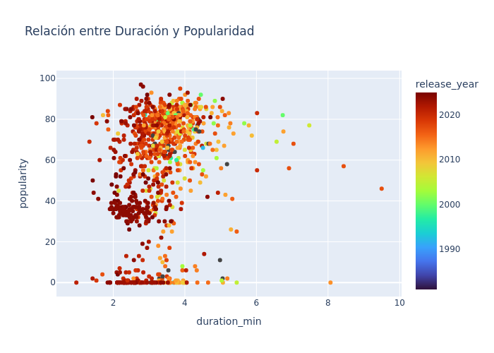
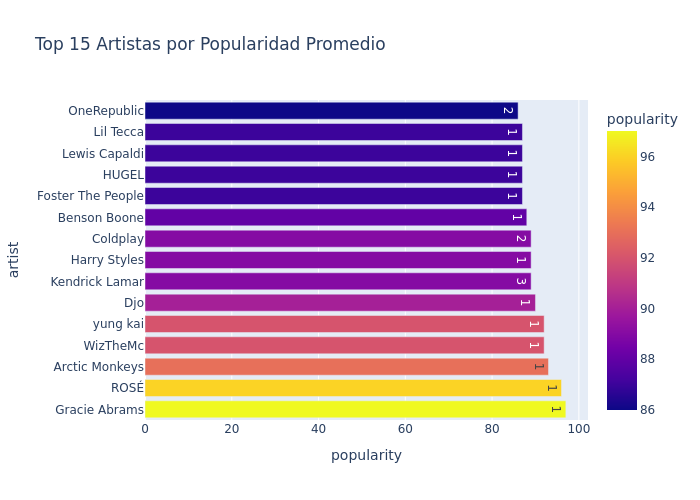

# Visualización de Datos - Análisis de Canciones

Este proyecto presenta una visualización de datos basada en un dataset de canciones populares de Spotify. El conjunto de datos contiene información como el año de lanzamiento, duración, popularidad, y artistas, permitiendo analizar tendencias en la música, y tiene como objetivo aplicar técnicas de análisis y visualización de datos reales.

## Gráficas

### Bubble Chart - Popularidad por Año
Esta gráfica muestra cómo ha variado la popularidad de las canciones a lo largo del tiempo. Cada burbuja representa una canción, su tamaño indica la popularidad y su posición horizontal el año de lanzamiento.

---

### Scatter Plot - Duración vs Popularidad
Esta gráfica compara la duración de las canciones con su nivel de popularidad. Nos ayuda a observar si existe una relación entre cuán larga es una canción y qué tan popular se vuelve.

---

### Top Artistas por Popularidad
Una visualización de los artistas más populares del dataset, basada en el promedio de popularidad de sus canciones. Ideal para identificar qué artistas dominan las listas.

---

link: https://eymardcantu.github.io/Portafolio_computo/